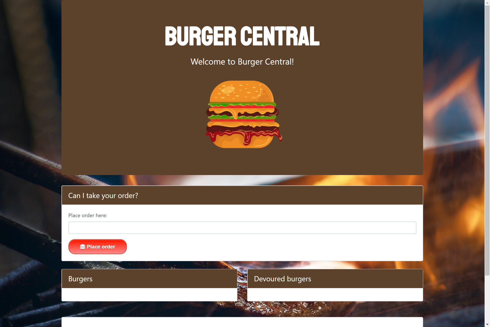
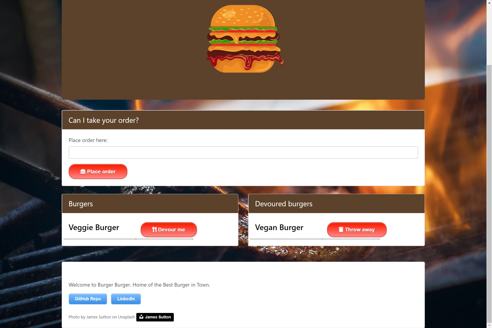

# Burger Central

A full stack application that allows you to create a Burger and devour it and throw it away, using Routes and MySql to update the database

## Live
https://rafael-burger-12345.herokuapp.com/

## About this project

  * [How the app works](#how-app-works)
 
### How the app works
This project is a full stack application that allows you to place an order for a burger. When you place an order, the burger you enter in the form field is added to the list of burgers on the left side of the screen. Each burger in the list has a <b>Devour me</b> button. Clicking this button moves the burger from the list on the left side of the screen to the list on the right. The list on the right is a list of burgers that have already been devoured. Each burger in this list has a <b>Throw away</b> button that allows you to remove the burger, which deletes the burger from the user interface as well as from the MySQL database. 

## Getting started
The following section will take you through the steps of setting up this application and getting it running locally on your computer.

If you don't want to set up this project locally and just want to see the deployed application, go to  .

To set up this application locally on your computer, perform the following steps:
  1. [Clone the repository](#clone-repository)
  2. [Install Node.js](#install-node)
  3. [Install the dependencies](#dependencies)
  4. [Install MySQL Workbench](#install-mysql)
  5. [Set up a development database](#database-setup)
  6. [Create a .env file to store your MySQL Password](#create-env)
  7. [Verify database connection information](#db-connect)
  8. [Start the server](#start-server)

### 1. Clone the repository
The first step is to clone the project repository to a local directory on your computer. To clone the repository, run the following commands:
<pre>
  git clone https://github.com/RafaelDe-Leon/Burger.git
  cd burger
</pre>

####Structure of the project

After you clone the repository, navigate to the project root directory (burger). The project directory structure is set up as follows:

<ul>
  <li> 
    
<b>server.js</b>: This file does the following:

		<ul>
	    	<li>Defines and requires the dependencies, including express, body-parser, and express-handlebars.</li>
	    	 <li>Sets up the Express server.</li>
	    	 <li>Sets up the Express server to handle data parsing using body-parser.</li>
	    	 <li>Points the server to the API routes, which gives the server a map of how to respond when users visit or request data from various URLs.</li>
         <li>Defines the port the server is listening on.</li>
	    	 <li>Starts the server.</li>
         <li>Allows the app to serve static content from the public directory.</li>
    	</ul>
  <li>
    
<b>public</b>: Contains the static content (images, Javascript, and CSS). 

    <ul>
      <li><b>assets/css/burger_style.css</b>: External CSS stylesheet.</li>
      <li><b>assets/img</b>: Contains icons and images used in the application.</li>
      <li><b>assets/js/burger.js</b>: Contains the jQuery ajax POST, DELETE, and PUT requests for adding a burger, throwing away a burger, and updating the devoured value for a burger, respectively.</li>
    </ul>
  </li>
  <li>
    
<b>models</b>: Contains a file called <b>burger.js</b>, which contains functions used to manage the application data and interact with the database.

    
The <b>burger.js</b> file also includes the code that will call the ORM functions using burger specific input for the ORM.

  </li>
  <li>
    
<b>db</b>: Contains 2 files:

    <ul>
      <li><b>schema.sql</b>: The database schema. The schema is what describes the structure of the database table, and the datatypes that each column of the table can contain. For this project, the database includes one table that includes columns for id, burger name, and devoured state (true or false).</li>
      <li><b>seeds.sql</b>: Used to populate the table in the development database with some starter burger data.</li>
    </ul>
  </li>
  <li>
    
<b>config</b>: Contains 2 files.
      <ul>
        <li><b>connection.js</b>: Contains the code to connect Node to MySQL.</li>
        <li><b>orm.js</b>: Contains the methods that will execute the necessary MySQL commands in the controllers. These methods are used to retrieve and store data in the database.</li>
      </ul>
  </li>
  <li>
    
<b>controllers</b>: Contains a file called <b>burgersController.js</b>, which contains different routes (GET, POST, PUT, and DELETE). These routes are used to pass information to and from the view and model objects.

  <li>
    
<b>views</b>: Contains the Handlebars files, which are templates used to generate the html files.
 
  </li>
  <li><b>package.json</b>: Lists the project dependencies (third party npm packages) and their version numbers.</li>
  <li><b>.gitignore</b>: Anything listed inside this file will not be tracked by GitHub when code is committed.</li>
  <li><b>package-lock.json</b>: Dependency tree for the project. Lists all the dependencies and their versions.</li>
</ul>

### 2. Install Node.js

If you don't already have Node.js installed on your computer, you can install the latest version here: https://nodejs.org/en/.

### 3. Install the dependencies

The following npm packages are dependencies to the project.

After you clone the repository to a local directory, change directory to the project root directory and run the following command to install the required npm packages:

<pre>npm install</pre>
<ul>
	<li><b>express</b> -  a Node.js web application framework (https://www.npmjs.com/package/express).</li>
	<li><b>body-parser</b> - used to parse incoming request bodies in a middleware. (https://www.npmjs.com/package/body-parser)</li>
	<li><b>dotenv</b> - used to retrieve the MySQL password from a .env file (https://www.npmjs.com/package/dotenv).</li>
  <li><b>mysql</b> - used to create a connection to the MySQL database via the command line.(https://www.npmjs.com/package/mysql)</li>
  <li><b>express-handlebars</b> - allows you to use handlebars to create templates to build the HTML.</li>(https://www.npmjs.com/package/express-handlebars)</li>
</ul>

Version information for each of these packages is available in the <b>package.json</b> file in the project root directory.

### 6. Create a .env file to store your MySQL Password</a>

If you set up MySQL to use a password to connect to your database, you need to provide your own <b>.env</b> file.
If you did not set up MySQL with a password, you can skip this step.

Create a file named <b>.env</b> in the project root directory (burger) with the following contents. Replace <i>mysql_password</i> with your actual MySQL password.

<pre>
# MySQL Password

MYSQL_PASSWORD='<i>mysql_password</i>'
</pre>

This file will be used by the dotenv npm package, which will pass the password value as an environment variable to the global process.env object in node. Because <b>.env</b> is specified in the .gitignore file, the password is kept private.

### 7. Verify database connection information</a>

Open the <b>config/connection.js</b> file and verify that the database connection information (host, user, port, password, and database) reflects the database you just created.

Modify the connection properties as needed to reflect your database instance.

For example:

<pre>
  var connection = mysql.createConnection({
    host: "localhost",
    port: 3306,
    user: "root",
    password: process.env.MYSQL_PASSWORD,
    database: "burger_db"
  });
</pre>

### 8. Start the server</a>

After performing all of the setup steps in the <b>Getting started</b> section, navigate to the project root directory (burger) and run the following command to start the server:

<pre>
node server.js
</pre>

To verify that the server has started and the application is working locally on your computer, open Chrome and go to <a href="http://localhost:8080">http://localhost:8080</a>.

## Screenshots

### Welcome to Burger Central 

### Devoured burgers

## </a> Technologies used to build app
* [Backend technologies](#Backend)
* [Frontend technologies](#Frontend)

### Backend technologies
* Node.js (https://nodejs.org/en/)
* MySQL (https://www.mysql.com/)
* Express (http://expressjs.com/)
* ORM - Object Relational Mapping (https://en.wikipedia.org/wiki/Object-relational_mapping)

### Frontend technologies
* HTML
* CSS
* Bootstrap (http://getbootstrap.com/)
* Javascript
* jQuery (https://jquery.com/)
* Handlebars (http://handlebarsjs.com/)

## Acknowledgments 
* Photo by James Sutton on <a href="https://www.unsplash.com">Unsplash.com</a>
* <a href="https://fontawesome.com/icons?d=gallery">Font Awesome</a> for Throw away burger/trash can icon.